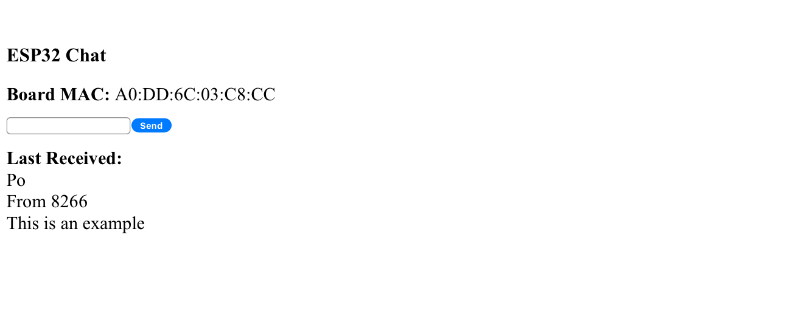
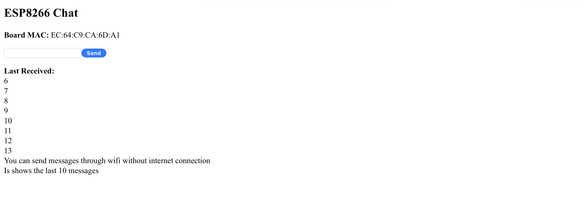

# ESP-NOW Wireless Chat System

## Project Overview

This project demonstrates a wireless chat system built using two different ESP devices: an ESP32 and an ESP8266. The system leverages ESP-NOW, a connectionless communication protocol developed by Espressif that enables direct device-to-device communication without requiring a traditional WiFi connection setup.




## How It Works

### System Architecture

The system consists of two main components:

1. **ESP32 Chat Node**: Acts as the primary device, configured with the ESP8266's MAC address.
2. **ESP8266 Chat Node**: Acts as the secondary device, configured with the ESP32's MAC address.

Each device:
- Creates its own WiFi Access Point (AP)
- Hosts a simple web server with a chat interface
- Communicates directly with the other device using ESP-NOW protocol

### Communication Flow

1. **Message Sending**:
   - User connects to either device's AP ("ESP32_Chat" or "ESP8266_Chat")
   - User enters a message through the web interface
   - Message is sent via ESP-NOW to the paired device

2. **Message Receiving**:
   - Incoming ESP-NOW messages are captured by the onDataRecv callback
   - Messages are stored in a message log (maximum 10 messages)
   - The web interface periodically polls for new messages using AJAX

### Web Interface

Both devices host a simple web server with a user interface that provides:
- A text field to enter messages
- A send button to transmit messages
- A display area for recently received messages
- Automatic refresh of messages every 1-2 seconds

## Setup Instructions

### Hardware Requirements

- 1 × ESP32 development board
- 1 × ESP8266 development board
- USB cables for programming

### Software Requirements

- PlatformIO IDE (recommended) or Arduino IDE
- Required libraries:
  - ESP32: WiFi, esp_now, AsyncTCP, ESPAsyncWebServer
  - ESP8266: ESP8266WiFi, ESP-NOW, ESPAsyncTCP, ESPAsyncWebServer

### Configuration

Before deployment, you must update the MAC addresses in the code:

1. In `esp-now/src/main.cpp`, update line 13 with your ESP8266's MAC address:
   ```cpp
   uint8_t peerMac[] = {0xEC, 0x64, 0xC9, 0xCA, 0x6D, 0xA1}; // ESP8266 MAC
   ```

2. In `esp-now-receiver/src/main.cpp`, update line 17 with your ESP32's MAC address:
   ```cpp
   uint8_t peerMac[] = {0xA0, 0xDD, 0x6C, 0x03, 0xC8, 0xCC}; // ESP32 MAC
   ```

You can find the MAC addresses by uploading a simple sketch to read the MAC or by checking the serial output when the devices boot up. It can also be found in the Web interface at the top.

### Using Two Identical Boards

If you have two of the same type of boards (e.g., two ESP32s or two ESP8266s), you can upload the same firmware to both devices. However, you must modify the MAC address in each board's code to point to the other board.

1. Upload the firmware to the first board
2. Note its MAC address (visible in serial output or web interface)
3. Modify the code to use the first board's MAC address as the peer
4. Upload the modified firmware to the second board

This approach works for either two ESP32s or two ESP8266s using the same codebase.

### Building and Flashing

#### Using PlatformIO

1. Open the project in PlatformIO IDE
2. Select the appropriate environment for each device
3. Build and upload the respective firmware to each device

```bash
# For ESP32
cd esp-now
pio run -t upload

# For ESP8266
cd esp-now-receiver
pio run -t upload
```

## Usage

1. Power both ESP devices
2. Connect your device (phone, tablet, laptop) to either "ESP32_Chat" or "ESP8266_Chat" WiFi network
3. Open a web browser and navigate to `192.168.4.1`
4. Enter messages in the text field and click Send
5. To test the full system, connect another device to the other ESP's WiFi network
6. Messages sent from either web interface will appear on both

## Technical Details

### ESP-NOW Protocol

ESP-NOW is a fast, connectionless communication protocol developed by Espressif that allows ESP32 and ESP8266 devices to communicate directly without requiring a traditional WiFi connection. Key features:

- Low power consumption
- No connection setup required
- Fast transmission (under 10ms)
- Maximum payload size of 250 bytes per transmission

### Message Storage

Messages are stored in a deque (double-ended queue) with a maximum size of 10 messages. When this limit is reached, the oldest message is removed to make room for new ones.

## Troubleshooting

- **Devices not communicating**: Verify the MAC addresses are correctly configured
- **Web server not responding**: Check that the device is powered and the WiFi AP is active
- **Messages not appearing**: Check the serial monitor for debugging information